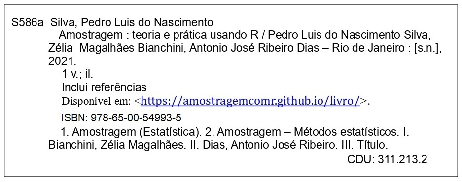

# Capa{-}

# Informações editoriais {-}

<left>
    **Publicação**   15 de outubro de 2020    
    
**Última atualização**   22 de junho de 2021
    
Permitida a reprodução total ou parcial com a devida citação de fonte.

**Comunicação com os autores**   
Pedro Luis do Nascimento Silva - pedronsilva@gmail.com   Antonio José Ribeiro Dias - vermelho2@gmail.com

**Revisão**    
Sonia Albieri

**Capa**    
Ubiratã Oliveira

**Ficha catalográfica**
</left>

# Bem-vindo {-}

Este é um livro escrito para apoiar a aprendizagem de **Amostragem**. Nosso objetivo principal é orientar um leitor no caminho para aprender os conceitos, as principais ideias e a usar as ferramentas de amostragem para resolver problemas.

Nossa escolha de temas a incluir no livro foi guiada, em grande parte, por nossa experiência com a coleção de pesquisas por amostragem do IBGE, onde trabalhamos por vários anos, e nossa atuação como professores na graduação e na pós graduação da ENCE. Também reflete nossa perspectiva quanto ao melhor caminho para aprender a trabalhar com **Amostragem**.

Nossa abordagem não busca ser exaustiva e, por esse motivo, são poucas as provas que incluímos dos resultados aqui discutidos. Fizemos a escolha deliberada de não apresentar demonstrações da maioria dos resultados relacionados a valor esperado e variância de estimadores. Essas demonstrações podem intimidar e afastar alguns e, além disso, cremos que estão bem cobertas em diversos outros livros sobre o tema. Aos leitores interessados em verificar os resultados, recomendamos a consulta ao excelente livro de @Sarndal1992 ou então às muitas referências incluídas ao longo do texto.

Em contraste, escolhemos enfatizar a apresentação de exemplos e de ferramentas computacionais, algo que não tem cobertura tão ampla na literatura sobre **Amostragem**. Nesse contexto, optamos também por enfatizar o uso de comandos ou recursos básicos do R, em lugar de pacotes mais avançados que estão disponíveis.

O livro está organizado em treze capítulos, nominados a seguir:

1) Introdução
2) Conceitos e Cadastros 
3) Visão Geral da Amostragem e Estimação 
4) Amostragem Aleatória Simples  
5) Estimação de Proporções  
6) Estimação de Razões e Funções de Totais 
7) Estimação para Domínios de Estudo 
8) Amostragem Sistemática Simples 
9) Outros Métodos de Amostragem com Equiprobabilidade 
10) Amostragem com Probabilidades Proporcionais ao Tamanho  
11) Amostragem Estratificada 
12) Amostragem Conglomerada 
13) Estimadores de Calibração 

Cada um dos capítulos é autocontido e vários deles podem ser omitidos num primeiro curso. Com exceção do Capítulo \@ref(calib), o material do livro pode ser coberto num curso com cerca de 45 horas de duração, como ministrado várias vezes na pós-graduação da ENCE. Caso necessário, algum(ns) dos Capítulos \@ref(proporc), \@ref(razao) ou \@ref(domin) pode(m) ser suprimidos ou separados para estudo individual. Os Capítulos \@ref(AS) e \@ref(binom) podem ser omitidos sem prejuízo da sequência. O conteúdo central do livro é formado por todos os capítulos não citados neste parágrafo. Tal conteúdo formaria, a nosso ver, o mínimo para cobertura num primeiro curso, no nível de graduação, sobre **Amostragem**.

Nossa opção ao escolher essa forma de publicação (livro em formato de hipertexto, hospedado na internet) se deve a três fatores principais: primeiro, não pretendemos comercializar o livro e, sim, torná-lo de acesso livre e aberto, como é a filosofia do software que usamos para sua elaboração e produção (R + RStudio + R Markdown + Github); segundo, essa forma de publicação permitirá atualizações mais rápidas e frequentes do conteúdo, o que favorece a correção de erros, revisões do texto, inclusão de exemplos ou tópicos novos etc.; terceiro, podemos usar esse caminho disponibilizar os [dados](arquivos-de-dados-usados-no-livro.html) que usamos para exemplos e exercícios. Esperamos que essa escolha não afaste os leitores que ainda gostam de livros em papel, como nós...

O leitor de qualquer livro precisa reconhecer que não é possível começar do zero: é preciso contar com conhecimento prévio de algumas ideias e conceitos básicos essenciais à compreensão do material tratado. Nossa abordagem pressupõe que o leitor está familiarizado com um curso básico de introdução à probabilidade e à inferência estatística, no nível tratado, por exemplo, em @Magalhaes2004 e @Magalhaes2006.
